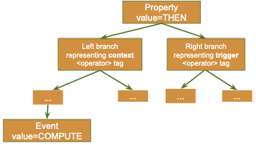

The 5Greplay rules are intended for formally specifying events on the network that denotes packets to be forwarded, dropped or modified. They rely on LTL (Linear Temporal Logic) and are written in XML format. This has the advantage of being a simple and straight forward structure for the verification and processing performed by the tool. In the context of this document, we use the terms of properties and rules interchangeably.

When defining a rule, users must indicate in the rule:
- which packet will be process (filtering)
- which action will be used (dropping, forwarding, or modifying)
- how to modify the packet (definition of the value to be changed in case of the action to be taken is a modification)


# Description

A 5Greplay rule is a XML file that can contain as many events as required to filter the desired packets to apply the actions defined by the properties (i.e forwarding or dropping it, with or without modification)
The file needs to begin with a `<beginning>` tag and end with `</beginning>`. 
Each property begins with a `<property>` tag and ends with `</property>`. 
A property is a *"general ordered tree"*, that can be graphically represented as shown in Figure




# Property validation

The nodes of the property tree are: the property node (required), op- erator nodes (optional) and event nodes (required). The property node is forcibly the root node and the event nodes are forcibly leaf nodes. In general, the left branch represents the context and the right branch rep- resents the trigger. This means that the property is found valid when the trigger is found valid; and the trigger is checked only if the context is valid.

The following example rule selects only the packets that come from 192.168.0.15. These packets will not be forwarded to the output NIC.

Thus, if 5Greplay is configured with the default action in the config file is forward, then it forwards the traffic that does not come from 192.168.0.15.

```xml
<property property_id="100" type_property="FORWARD" description="Drop any IP traffic that comes from 192.168.0.15" if_satisfied="#drop()">
   <event description="Not interested traffic"
      boolean_expression="(ip.src == ’192.168.0.15’)"/>
</property>
```

# Property attributes

The `<property>` tag contains several attributes, some required, some optional:


| Attribute | Accepted values | Req./opt. | Default value | Description |
|-----------|-----------------|-----------|---------------|-------------|
